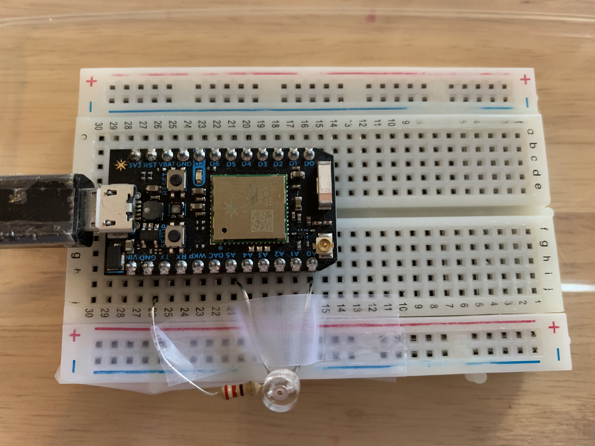
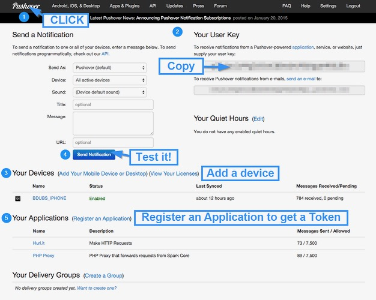
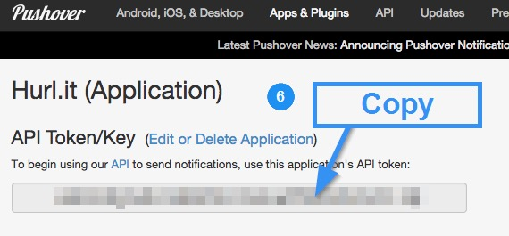

## RESET PHOTON
[reset photon](https://docs.particle.io/tutorials/device-os/led/core/#safe-mode)

# Project2

[Click Here](https://particle.hackster.io/yatinagarwal/light-detecting-email-sender-db18f4)

## Light Sensor with Particle Photon

Required Parts:
<br>- Particle Photon
<br>- Photo Sensor
<br>- Resistor
<!---
[link](https://docs.particle.io/tutorials/hardware-projects/maker-kit/#tutorial-3-conference-room-monitor)
--->

### Step 1: Set up your Photon
- Using Your Computer: Go to particle.io/setup and follow the instructions to create an account and set up your Photon.
- Using Your Phone & Download the Particle Mobile App [iPhone](https://itunes.apple.com/us/app/particle-build-photon-electron/id991459054?ls=1&mt=8) & [Android](https://play.google.com/store/apps/details?id=io.particle.android.app) to create an account and set up your Photon.


<hr>

### Step 2: Connect Photo Sensor & Resistor to Photon
- Connect your sensor to a digital or analog input on the Photon. Follow these examples for hooking up common sensors.
```
Sensor Pin  | Photon Pin
       pin1 | A0 
       pin2 | A5
       OUT  | D0 
       
Resistor Pin  | Photon Pin
         pin1 | A0 
         pin2 | GRND
```
#### Set up the hardware

Should look like this


<br>
<hr>

### Step 3: Setup Push Notifications
To receive your push notification there is a little setup if you’ve never done it before, but once you do you’ll never have to touch it again. There are a ton of services you could use, but the one I like is Pushover.net. 

- Setup an account with [Pushover.net](https://pushover.net/) then follow these instructions:
- Follow below steps (see below image)





- Click on the Pushover logo to get to your dashboard.
- Copy your User Key. This is the value for the the user query field below.
- Add a device that is going to receive these push notifications. Primarily an iOS or Android phone/tablet… whatever you can download the Pushover app to.
- Send a test message and make sure it’s working!
- Register an application named exceedlight. 
- When you are done click on the application’s name from step 5 and copy the API Token/Key from that page. This is the value for the token query field below.

<hr>

### Step 4: Create a WebHook

- Go to https://console.particle.io/integrations 
- Click on New Integration
- Change "Request Format" JSON
- Click WebHook > CUSTOM TEMPLATE
- Paste below text and replace user and token with above user key and API Token
```
{
    "event": "exceedlight",
    "url": "https://api.pushover.net/1/messages.json",
    "requestType": "POST",
    "noDefaults": false,
    "rejectUnauthorized": false,
    "json": true,
    "query": {
        "user": "YOUR_USER_KEY",
        "token": "YOUR_API_TOKEN_KEY",
        "title": "Exceed Light",
        "message": "{{SPARK_EVENT_VALUE}}"
    }
}
```

- Click Create WebHook

<hr>

### Step 5: Create Particle App

- Go to https://build.particle.io/build/new 
- Title: LightDetect
- Paste Below Code
```
int led = D7; // This is where your can use can plug in a different LED. The other side should go to a resistor connected to GND.

int photoresistor = A0; // This is where your photoresistor is plugged in. The other side goes to the "power" pin (refer to diagram).

int power = A5; // This is the other end of your photoresistor. The other side is plugged into the "photoresistor" pin (above).
// The reason we have plugged one side into an analog pin instead of to "power" is because we want a very steady voltage to be sent to the photoresistor.
// That way, when we read the value from the other side of the photoresistor, we can accurately calculate a voltage drop.

int analogvalue; // Here we are declaring the integer variable analogvalue, which we will use later to store the value of the photoresistor.

void setup() {

    // First, declare all of our pins. This lets our device know which ones will be used for outputting voltage, and which ones will read incoming voltage.
    pinMode(led,OUTPUT); // Our LED pin is output (lighting up the LED)
    pinMode(photoresistor,INPUT);  // Our photoresistor pin is input (reading the photoresistor)
    pinMode(power,OUTPUT); // The pin powering the photoresistor is output (sending out consistent power)

    // Next, write one pin of the photoresistor to be the maximum possible, so that we can use this for power.
    digitalWrite(power,HIGH);

    // We are going to declare a Particle.variable() here so that we can access the value of the photoresistor from the cloud.
    Particle.variable("analogvalue", &analogvalue, INT);
    // This is saying that when we ask the cloud for "analogvalue", this will reference the variable analogvalue in this app, which is an integer variable.

}

void loop() {

    // check to see what the value of the photoresistor is and store it in the int variable analogvalue
    analogvalue = analogRead(photoresistor);


    if(analogvalue>=5){ //play with this number
      delay(100);
      char buf[200]; // need a buffer for that
      sprintf(buf,"%d",analogvalue);
      const char* p = buf;
      Particle.publish("light",buf,60,PRIVATE);
        digitalWrite(led, HIGH);
        Spark.publish("Light_limit","Exceeded",60,PRIVATE);
        Particle.publish("exceedlight", "Light Value is Exceeded", 60, PRIVATE);
        delay(5000); //delay for LED
        digitalWrite(led, LOW);
        delay(10000); //10 second gap for each observation
        // Add a delay to prevent getting tons of emails from IFTTT
    }
}


```
- Click Save
- Click Flash

That’s It! You should now see notifications when light is exceeded

If all goes well, the D7 LED on your Photon should light up when light is exceeded. 


