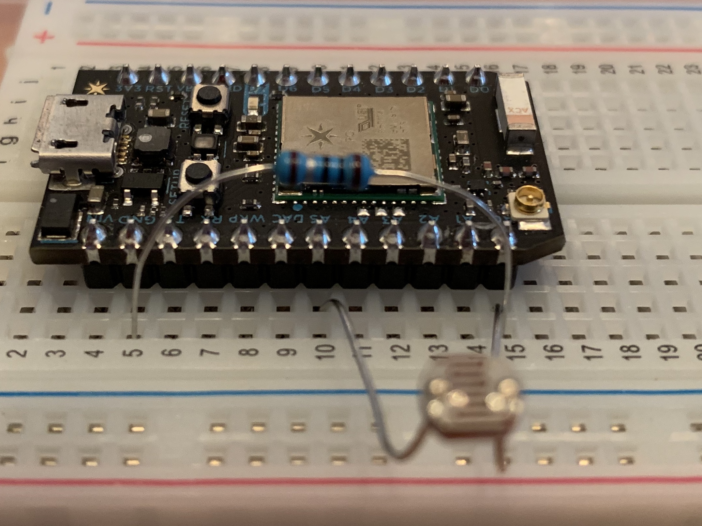

<!---
[Click Here](https://particle.hackster.io/yatinagarwal/light-detecting-email-sender-db18f4)
--->
## Light Sensor with Particle Photon

<p>Required Parts: (Provided)<br />- <a href="https://www.amazon.com/Particle-Reprogrammable-Development-Prototyping-Electronics/dp/B016YNU1A0">Particle Photon</a> <br /><span>- <a href="https://www.amazon.com/gp/product/B01N7V536K/ref=ppx_yo_dt_b_asin_title_o04_s00?ie=UTF8&amp;psc=1">Photo Sensor</a> </span><br /><span>- <a href="https://www.amazon.com/gp/product/B07G97ZMTN/ref=ppx_yo_dt_b_asin_title_o00_s00?ie=UTF8&amp;psc=1">Resistor</a>
OPTIONAL: PowerShield (Battery) [link](https://www.amazon.com/gp/product/B06XJ64G8G/ref=ppx_yo_dt_b_asin_title_o02_s00?ie=UTF8&psc=1)</span></p>

<!---
[link](https://docs.particle.io/tutorials/hardware-projects/maker-kit/#tutorial-3-conference-room-monitor)
--->

### Step 1: SETUP WIFI & RESET PHOTON

<a href="https://iotrvc.github.io/reset/" target="blank">Click Here</a>

### Step 2: Connect Photo Sensor & Resistor to Photon
- Connect your sensor to a digital or analog input on the Photon. Follow these examples for hooking up common sensors.

```

Sensor Pin  | Photon Pin
       pin1 | A0 
       pin2 | A5
       OUT  | D0 
       
Resistor Pin  | Photon Pin
         pin1 | A0 
         pin2 | GRND
         
```

#### Set up the hardware

Should look like this


<br>
<hr>

### Step 3: Setup Push Notifications
To receive your push notification we will use IFTTT

- Setup an account with [IFTTT](https://ifttt.com) then follow these instructions:
- Follow below steps (see below image)

Create IFTTT recipe for Particle

1. Click NEW APPLET button
1. Click + symbol after IF
1. Type par and Select Particle
1. Click New Event Published
1. Type in Particle.Publish Event Name "exceedlight" (NO QUOTES)
1. Type in Particle.Publish Event Contents "Light Value is Exceeded" (NO QUOTES)
1. Select Particle Photon Device
1. Click + symbol after THEN
1. Select CALL MY PHONE Service to send Particle Event data to
1. Click FINISH


<a href="https://ifttt.com/applets/idAgpcnV-exceedlight_call" target="blank">GET IFTTT RECIPE</a>


<hr>

### Step 4: Create Particle App

- Go to https://build.particle.io/build/new 
- Title: Exceeded_Light_Monitor
- Paste Below Code


```cpp

int led = D7; // This is where your can use can plug in a different LED. The other side should go to a resistor connected to GND.

int photoresistor = A0; // This is where your photoresistor is plugged in. The other side goes to the "power" pin (refer to diagram).

int power = A5; // This is the other end of your photoresistor. The other side is plugged into the "photoresistor" pin (above).
// The reason we have plugged one side into an analog pin instead of to "power" is because we want a very steady voltage to be sent to the photoresistor.
// That way, when we read the value from the other side of the photoresistor, we can accurately calculate a voltage drop.

int analogvalue; // Here we are declaring the integer variable analogvalue, which we will use later to store the value of the photoresistor.

void setup() {

    // First, declare all of our pins. This lets our device know which ones will be used for outputting voltage, and which ones will read incoming voltage.
    pinMode(led,OUTPUT); // Our LED pin is output (lighting up the LED)
    pinMode(photoresistor,INPUT);  // Our photoresistor pin is input (reading the photoresistor)
    pinMode(power,OUTPUT); // The pin powering the photoresistor is output (sending out consistent power)

    // Next, write one pin of the photoresistor to be the maximum possible, so that we can use this for power.
    digitalWrite(power,HIGH);

    // We are going to declare a Particle.variable() here so that we can access the value of the photoresistor from the cloud.
    Particle.variable("analogvalue", &analogvalue, INT);
    // This is saying that when we ask the cloud for "analogvalue", this will reference the variable analogvalue in this app, which is an integer variable.

}

void loop() {

    // check to see what the value of the photoresistor is and store it in the int variable analogvalue
    analogvalue = analogRead(photoresistor);


    if(analogvalue>=5){ //play with this number
      delay(100);
      char buf[200]; // need a buffer for that
      sprintf(buf,"%d",analogvalue);
      const char* p = buf;
      Particle.publish("light",buf,60,PRIVATE);
        digitalWrite(led, HIGH);
       // Spark.publish("Light_limit","Exceeded",60,PRIVATE);
        Particle.publish("exceedlight", "Light Value is Exceeded", 60, PRIVATE);
        delay(5000); //delay for LED
        digitalWrite(led, LOW);
        delay(10000); //10 second gap for each observation
        // Add a delay to prevent getting tons of emails from IFTTT
    }
}


```

- Click Save
- Click Flash

That’s It! You should now see notifications when light is exceeded

If all goes well, the D7 LED on your Photon should light up when light is exceeded. 

YOU WILL GET A CALL FROM IFTTT WHEN LIGHT EXCEEDS IS TRIGGERED

<BR>
<video src="1.mp4" width="420" height="400" controls preload></video>


